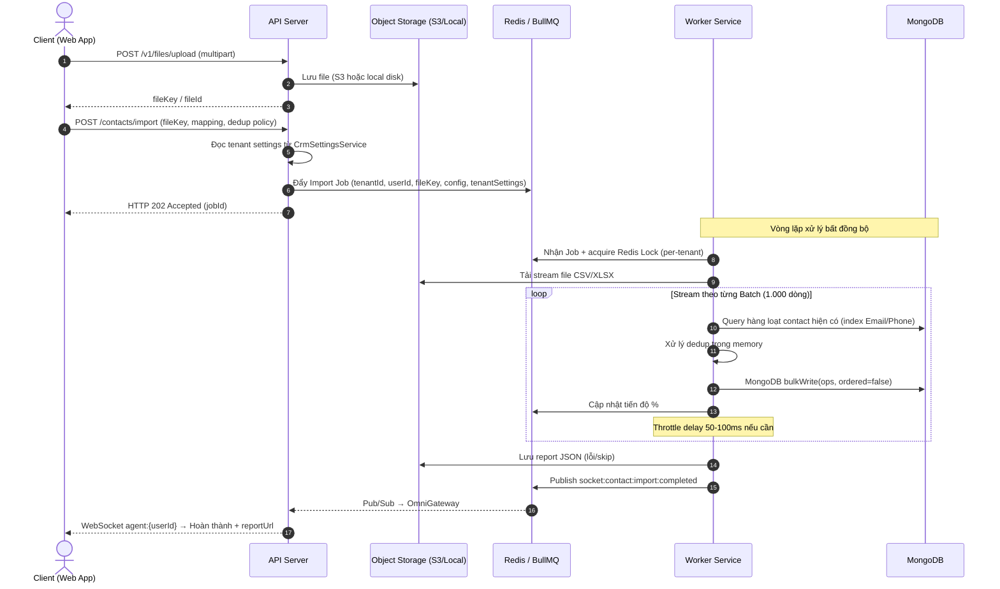

# Kiến trúc Import Contact & Xử lý Trùng lặp — Đặc tả Production

Tài liệu này phân tích kiến trúc hiện tại và đưa ra kế hoạch triển khai đầy đủ cho tính năng import contact với tập dữ liệu lớn (100k đến 1M+ contact). Mọi claim kỹ thuật đã được **cross-verify với codebase thực tế** (xem phần "Xác minh Codebase" bên dưới).

---

## Tổng quan: Phân chia công việc API & Web

### 🖥️ API (Backend — `crm-api`)

| Hạng mục                                | Mô tả                                                                                  |
| --------------------------------------- | -------------------------------------------------------------------------------------- |
| `POST /v1/contacts/import`              | Nhận file key + field mapping + dedup policy, đẩy job vào BullMQ, trả về `202 + jobId` |
| `GET /v1/contacts/import-status/:jobId` | Trả về trạng thái job, % tiến độ, summary counts, `reportUrl`                          |
| `ContactImportProcessor`                | Worker: stream parse CSV/XLSX → dedup → `bulkWrite` → lưu report                       |
| `ContactImportReportService`            | Serialize báo cáo lỗi ra file JSON (S3 hoặc local), trả về URL                         |
| Redis Pub/Sub                           | Publish sự kiện `socket:contact:import:completed` khi xong                             |
| WebSocket Gateway                       | Subscribe Redis channel, đẩy thông báo real-time tới client                            |

### 🌐 Web (Frontend — CRM Dashboard)

| Bước | Màn hình / Component | Mô tả                                                                                                |
| ---- | -------------------- | ---------------------------------------------------------------------------------------------------- |
| 1    | **Upload File**      | Drag & drop hoặc chọn file `.csv` / `.xlsx`, validate client-side (size, extension)                  |
| 2    | **Field Mapping**    | Hiển thị các cột CSV, cho phép user kéo/thả map sang field của Contact (`firstName`, `emails`, v.v.) |
| 3    | **Cấu hình Import**  | Chọn dedup policy (`skip` / `overwrite` / `merge`), bật/tắt `dryRun`, bật/tắt `triggerAutomations`   |
| 4    | **Dry-run Preview**  | Hiển thị kết quả preview: sẽ insert N, update M, skip K, lỗi W — trước khi thực sự import            |
| 5    | **Progress Bar**     | Sau khi confirm, hiển thị thanh tiến độ realtime nhận từ WebSocket (`job.progress %`)                |
| 6    | **Kết quả & Report** | Khi hoàn thành: hiển thị summary, nút tải báo cáo lỗi (link tới `reportUrl`)                         |

---

## Phân tích kiến trúc: Hiện trạng

Sau khi review codebase:
1. **Export đã có**: CRM đang dùng BullMQ (`@nestjs/bullmq`) với Redis và worker `ContactExportProcessor` (kế thừa `BaseTenantConsumer`) để stream, nén và lưu CSV contact.
2. **Import chưa có**: Hiện không có endpoint hay background processor nào xử lý việc nhập file contact.
3. **Hạ tầng tái sử dụng**: Pipeline import sẽ tái dùng `ContactExportStorageService` (S3 / local dual-mode), base class `BaseTenantConsumer`, `RedisLockService`, `CrmSettingsService`, và hai compound index `{ tenantId: 1, emails: 1 }` + `{ tenantId: 1, phones: 1 }` đã có sẵn trên collection `contacts`.

### Xác minh Codebase (Cross-Reference)

Tất cả các claim kiến trúc ở trên đã được xác minh trực tiếp với source code:

| Claim                                  | File tham chiếu                                       | Dòng     | Trạng thái |
| -------------------------------------- | ----------------------------------------------------- | -------- | ---------- |
| Export dùng `BaseTenantConsumer`       | `src/contacts/contact-export.processor.ts`            | L22      | ✅ Xác nhận |
| Worker đăng ký qua `isWorkerRuntime()` | `src/contacts/contacts.module.ts`                     | L27-29   | ✅ Xác nhận |
| Redis Pub/Sub cho cross-process events | `src/contacts/contact-export.processor.ts`            | L100-109 | ✅ Xác nhận |
| OmniGateway subscribe Redis channel    | `src/omni-inbound/services/omni.gateway.ts`           | L57-64   | ✅ Xác nhận |
| Dual-mode storage (S3/local)           | `src/contacts/contact-export-storage.service.ts`      | L73-126  | ✅ Xác nhận |
| `createdById`/`updatedById` required   | `src/contacts/.../entities/contact.schema.ts`         | L93-105  | ✅ Xác nhận |
| Index `{ tenantId:1, emails:1 }`       | `src/contacts/.../entities/contact.schema.ts`         | L182     | ✅ Xác nhận |
| Index `{ tenantId:1, phones:1 }`       | `src/contacts/.../entities/contact.schema.ts`         | L221-224 | ✅ Xác nhận |
| `DEFAULT_CONTACT_IDENTITY` schema      | `src/crm-settings/tenant-settings-seeding.service.ts` | L165-171 | ✅ Xác nhận |
| `CrmSettingsService` exported          | `src/crm-settings/crm-settings.module.ts`             | exports  | ✅ Xác nhận |
| `RedisLockService` sẵn có              | `src/redis/redis.module.ts`                           | exports  | ✅ Xác nhận |
| Export enqueue pattern                 | `src/contacts/contacts.service.ts`                    | L579-597 | ✅ Xác nhận |

---

## Sơ đồ luồng tổng thể



### Quyết định: Luồng Upload File

> **Quyết định: Tái dùng `FileModule` có sẵn** (không build presigned URL riêng).

| Tiêu chí                 | Reuse FileModule ✅ | Presigned URL  | Multipart qua API |
| ------------------------ | ------------------ | -------------- | ----------------- |
| Local-only deployment    | ✅ Hoạt động        | ❌ Cần S3       | ✅ Hoạt động       |
| Giảm tải API             | ❌ Qua API          | ✅ Trực tiếp S3 | ❌ Qua API         |
| Code mới cần viết        | Ít nhất            | Nhiều nhất     | Trung bình        |
| Consistency với hệ thống | ✅ Cùng pattern     | ❌ Pattern mới  | ✅ Gần giống       |

**Lý do**: `FileModule` đã có sẵn upload endpoint, hỗ trợ cả S3 và local storage. Client upload file qua `POST /v1/files/upload`, nhận `fileKey`, sau đó truyền `fileKey` vào `POST /contacts/import`. Worker đọc file từ storage dùng `ContactExportStorageService` (đã hỗ trợ dual-mode). Với file ≤ 50MB, upload qua API không gây bottleneck đáng kể.

---

## Danh sách file cần tạo / sửa (API)

| File                                            | Hành động   | Mục đích                                                     |
| ----------------------------------------------- | ----------- | ------------------------------------------------------------ |
| `src/contacts/contacts.constants.ts`            | **SỬA**     | Thêm constant `CONTACT_IMPORT_QUEUE`                         |
| `src/contacts/dto/start-import.dto.ts`          | **TẠO MỚI** | DTO cho body `POST /contacts/import`                         |
| `src/contacts/dto/import-job-status.dto.ts`     | **TẠO MỚI** | DTO response `GET /contacts/import-status/:jobId`            |
| `src/contacts/contact-import.processor.ts`      | **TẠO MỚI** | BullMQ worker — stream parse, dedup, bulkWrite               |
| `src/contacts/contact-import-report.service.ts` | **TẠO MỚI** | Serialize & lưu báo cáo lỗi/skip                             |
| `src/contacts/contacts.service.ts`              | **SỬA**     | Thêm `startImport()` và `getImportStatus()`                  |
| `src/contacts/contacts.controller.ts`           | **SỬA**     | Thêm endpoint `POST /import` và `GET /import-status/:jobId`  |
| `src/contacts/contacts.module.ts`               | **SỬA**     | Đăng ký import queue; thêm processor vào `workerProviders`   |
| `src/omni-inbound/services/omni.gateway.ts`     | **SỬA**     | Thêm channel + handler cho `socket:contact:import:completed` |

## Danh sách component cần tạo / sửa (Web)

| File / Component                           | Hành động   | Mục đích                                                      |
| ------------------------------------------ | ----------- | ------------------------------------------------------------- |
| `pages/contacts/import/index.tsx`          | **TẠO MỚI** | Trang import chính (multi-step wizard)                        |
| `components/import/FileUploadStep.tsx`     | **TẠO MỚI** | Drag & drop upload, validate extension/size                   |
| `components/import/FieldMappingStep.tsx`   | **TẠO MỚI** | Giao diện map cột CSV sang Contact field                      |
| `components/import/ImportConfigStep.tsx`   | **TẠO MỚI** | Chọn dedup policy, dry-run toggle, automation toggle          |
| `components/import/DryRunPreviewStep.tsx`  | **TẠO MỚI** | Hiển thị kết quả dry-run trước khi thực hiện                  |
| `components/import/ImportProgressStep.tsx` | **TẠO MỚI** | Progress bar realtime qua WebSocket                           |
| `components/import/ImportResultStep.tsx`   | **TẠO MỚI** | Summary + nút tải báo cáo lỗi                                 |
| `hooks/useImportJobStatus.ts`              | **TẠO MỚI** | Hook polling `GET /import-status/:jobId` + WebSocket listener |
| `services/contactImport.service.ts`        | **TẠO MỚI** | API calls: upload file, start import, get status              |

---

## Đặc tả kỹ thuật (API)

### 1. API Endpoints

**`POST /v1/contacts/import`**

**Controller decorators** (tham chiếu: export dùng `@Throttle({ limit: 10 })` tại `contacts.controller.ts:101`):
```typescript
@Throttle({ default: { limit: 3, ttl: 60_000 } })  // Chặt hơn export vì import nặng hơn
@Post('import')
@RequirePermission('create', 'contacts')            // Dùng 'create' vì chưa có permission 'import' trong RBAC
```

**Request body**:
```json
{
  "fileKey": "imports/contacts-2026.csv",
  "mapping": {
    "First Name": "firstName",
    "Last Name": "lastName",
    "Email Address": "emails",
    "Mobile Phone": "phones",
    "Company": "companyName"
  },
  "deduplication": {
    "matchingFields": ["emails", "phones"],
    "policy": "merge"
  },
  "dryRun": false,
  "triggerAutomations": false
}
```
- Trả về: `202 Accepted` với `{ "jobId": "...", "status": "queued" }`
- **Lưu ý quan trọng**: Cài đặt tenant (`uniqueEmail`, `uniquePhone`, `multipleEmailsAllowed`, `multiplePhonesAllowed`) được đọc từ `CrmSettingsService` **tại lúc enqueue** và serialize vào `job.data`. Worker KHÔNG query `crm_settings` trong vòng lặp xử lý — tránh latency và đảm bảo nhất quán với thời điểm user trigger.

**DTO Validation Rules (`StartImportDto`)**:
```typescript
export class StartImportDto {
  @IsString()
  @IsNotEmpty()
  fileKey: string;                    // Bắt buộc — từ FileModule upload

  @IsObject()
  @ValidateNested()
  mapping: Record<string, string>;    // Bắt buộc — phải chứa ít nhất firstName + lastName

  @IsObject()
  @IsOptional()
  deduplication?: {
    matchingFields: ('emails' | 'phones')[];  // Chỉ cho phép subset này
    policy: 'skip' | 'overwrite' | 'merge';   // Enum validation
  };

  @IsBoolean()
  @IsOptional()
  dryRun?: boolean;                   // Default: false

  @IsBoolean()
  @IsOptional()
  triggerAutomations?: boolean;       // Default: false
}
```

> **Validation bổ sung trong service**: Trước khi enqueue, `startImport()` phải validate:
> 1. `mapping` chứa ít nhất `firstName` và `lastName` (required fields trong `contact.schema.ts:30-34`)
> 2. `deduplication.matchingFields` chỉ chấp nhận `['emails', 'phones']` (có index hỗ trợ)
> 3. `fileKey` tồn tại trong storage — gọi `storageService.exists(fileKey)` trước khi enqueue

**`GET /v1/contacts/import-status/:jobId`**
```typescript
@Get('import-status/:jobId')
@RequirePermission('create', 'contacts')
```
- Trả về: trạng thái job (`failed`, `completed`, `active`, `waiting`), `progress %`, summary counts, `reportUrl`.
- **Security**: Validate `job.data.tenantId` và `job.data.userId` khớp với user hiện tại (tham chiếu: `getExportStatus()` tại `contacts.service.ts:610-617`).

### 2. Stream Ingestion — Bảo vệ bộ nhớ Worker

**Vấn đề**: Đọc 1.000.000 dòng CSV vào memory cùng lúc cần ~300-500MB RAM, có thể gây OOM crash Node.js.

**Giải pháp**: Dùng streaming parser kết nối trực tiếp với readable stream từ S3/storage, parse tuần tự, gom thành batch 1.000 dòng trước khi dedup & write.

#### Định dạng file hỗ trợ

| Định dạng | Thư viện      | Ghi chú                                                    | Giới hạn               |
| --------- | ------------- | ---------------------------------------------------------- | ---------------------- |
| `.csv`    | `csv-parser`  | Format chính, true streaming, overhead thấp nhất           | Không giới hạn dòng    |
| `.xlsx`   | **`exceljs`** | Phổ biến trong CRM; hỗ trợ `worksheet.eachRow()` streaming | Khuyến nghị ≤ 50k dòng |

> **⚠️ Lưu ý quan trọng về XLSX**: Thư viện `xlsx` (SheetJS) community edition **KHÔNG hỗ trợ true streaming** cho file `.xlsx`. XLSX là ZIP container, SheetJS phải đọc toàn bộ file vào memory để decompress. File 1M dòng XLSX (~100-200MB) sẽ cần ~500MB+ RAM → OOM crash.
>
> **Quyết định**: Dùng `exceljs` thay vì `xlsx`. `exceljs` có streaming API thực sự:
> ```typescript
> const workbook = new ExcelJS.stream.xlsx.WorkbookReader(readableStream);
> for await (const worksheet of workbook) {
>   for await (const row of worksheet) {
>     // Process từng dòng, không load toàn bộ vào RAM
>   }
> }
> ```
> Với dataset > 50k dòng, khuyến khích user chuyển sang CSV để đạt hiệu năng tối ưu. UI hiển thị thông báo khi detect XLSX > 50k dòng.

Processor implement interface `IImportParser` để swap format mà không sửa core logic:
```typescript
interface IImportParser {
  /** Trả về async iterator, mỗi item là 1 parsed row (object) */
  parse(stream: Readable): AsyncIterable<Record<string, string>>;
  /** Đếm tổng số dòng (dùng cho progress tracking) */
  countRows(stream: Readable): Promise<number>;
}
```

#### Tracking tiến độ (công thức đã sửa)

Export processor hiện tại có bug tiệm cận (không bao giờ đạt 80%). Import dùng công thức chính xác:
```typescript
const progressPct = Math.floor((processedCount / totalRows) * 100);
await job.updateProgress(Math.min(99, progressPct)); // 100% chỉ set sau khi lưu report
```

### 3. Tối ưu ghi DB — MongoDB `bulkWrite`

- Tránh gọi `findOneAndUpdate` / `create` đơn lẻ (100k round-trip = hàng giờ).
- Mỗi batch 1.000 dòng: query hàng loạt bằng `$in` → resolve dedup in-memory → `bulkWrite` một lần.
- **`ordered: false`** — Khi 1 document trong batch fail validation, các document còn lại vẫn được xử lý. Nếu dùng `ordered: true`, batch dừng ngay khi gặp lỗi đầu tiên → mất data.

```typescript
await contactModel.bulkWrite(operations, { ordered: false });
// ordered: false → tiếp tục xử lý khi gặp lỗi → thu thập tất cả lỗi → ghi vào report
```

#### ⚠️ Trường bắt buộc trong `insertOne`

Schema `contacts` có **`createdById` và `updatedById` là `required: true`**. Mọi `insertOne` trong `bulkWrite` phải populate từ `job.data.userId`, nếu không Mongoose sẽ throw validation error và cả batch sẽ fail.

```typescript
const insertOp = {
  insertOne: {
    document: {
      ...mappedRow,
      tenantId: job.data.tenantId,
      createdById: job.data.userId,   // ← BẮT BUỘC
      updatedById: job.data.userId,   // ← BẮT BUỘC
      createdAt: new Date(),
      updatedAt: new Date(),
    },
  },
};
```

#### Xác minh Index (trước khi deploy)

```typescript
// Đã có trong contact.schema.ts — KHÔNG được xóa:
ContactSchema.index({ tenantId: 1, emails: 1 });
ContactSchema.index({ tenantId: 1, phones: 1 }, { name: 'tenant_phone_lookup' });
```
Chạy `db.contacts.getIndexes()` trên staging và verify output `explain('executionStats')` cho thấy `IXSCAN`, không phải `COLLSCAN`.

---

## Đặc tả kỹ thuật (Web)

### Luồng UX — Multi-step Wizard

```
Bước 1: Upload File
  → Drag & drop hoặc chọn file
  → Validate: chỉ chấp nhận .csv / .xlsx, tối đa 50MB
  → Hiển thị tên file, kích thước, số dòng ước tính

Bước 2: Field Mapping
  → Parse header dòng đầu của file → hiển thị danh sách cột
  → Giao diện: cột bên trái (cột CSV), kéo thả hoặc dropdown bên phải (Contact field)
  → Auto-suggest: "Email Address" → "emails", "Phone" → "phones" (fuzzy match)
  → Highlight cột chưa được map (màu vàng), cột bắt buộc chưa map (màu đỏ)

Bước 3: Cấu hình
  → Chọn Dedup Policy: Skip / Overwrite / Merge (có tooltip giải thích từng option)
  → Toggle "Dry-run trước": bật mặc định, user phải chủ động tắt
  → Toggle "Kích hoạt Automation": tắt mặc định, có cảnh báo về thời gian tăng

Bước 4: Dry-run Preview (nếu bật)
  → Gọi API với dryRun: true
  → Hiển thị: sẽ tạo mới X | cập nhật Y | bỏ qua Z | lỗi W
  → Nút "Tiếp tục import thật" hoặc "Quay lại chỉnh sửa"

Bước 5: Đang xử lý
  → Gọi POST /contacts/import
  → Hiển thị progress bar realtime (WebSocket hoặc polling mỗi 2s)
  → Hiển thị: "Đã xử lý 45.230 / 100.000 contact (45%)"
  → Không cho phép đóng tab (beforeunload warning)

Bước 6: Kết quả
  → Tạo mới: N | Cập nhật: M | Bỏ qua: K | Lỗi: W
  → Nút "Tải báo cáo lỗi" (nếu W > 0) → download reportUrl
  → Nút "Xem danh sách contact" → redirect về Contacts list
```

### Giao tiếp Real-time (WebSocket)

Web subscribe vào WebSocket event `contact:import:completed` (hoặc `contact:import:progress`). Nếu WebSocket không khả dụng, fallback sang polling `GET /import-status/:jobId` mỗi 2 giây.

```typescript
// useImportJobStatus.ts
const { progress, status, result } = useImportJobStatus(jobId, {
  pollingInterval: 2000,  // fallback nếu không có WS
  onCompleted: (result) => setStep('result'),
  onFailed: (reason) => setError(reason),
});
```

### Xử lý lỗi phía Web

| Trường hợp                                      | Xử lý                                                            |
| ----------------------------------------------- | ---------------------------------------------------------------- |
| File > 50MB                                     | Reject ngay client-side, không upload                            |
| Sai định dạng file                              | Thông báo rõ, chỉ chấp nhận `.csv`, `.xlsx`                      |
| Cột bắt buộc chưa map (`firstName`, `lastName`) | Disable nút "Tiếp theo" ở bước mapping                           |
| Job failed (server error)                       | Hiển thị lý do lỗi từ `failedReason`, cho phép retry             |
| Tab bị đóng giữa chừng                          | `beforeunload` warning; user có thể check lại status qua history |

---

## Tùy chọn Dedup (Tenant chọn)

| Chính sách      | Hành động khi tìm thấy trùng                                                                                  | Kịch bản sử dụng                         |
| :-------------- | :------------------------------------------------------------------------------------------------------------ | :--------------------------------------- |
| **`skip`**      | Bỏ qua dòng import. Ghi vào "skipped" trong báo cáo.                                                          | Giữ nguyên dữ liệu sạch trong DB.        |
| **`overwrite`** | Ghi đè toàn bộ field bằng dữ liệu import.                                                                     | Cập nhật thông tin mới nhất từ file CRM. |
| **`merge`**     | 1. Append vào array (emails, phones).<br>2. Fill field còn trống.<br>3. Giữ nguyên nếu cả hai đều có dữ liệu. | Làm giàu profile không mất dữ liệu cũ.   |

### Lưu trữ cấu hình
Lựa chọn mặc định của tenant lưu trong `crm_settings` key `contact_identity`:
```typescript
const DEFAULT_CONTACT_IDENTITY = {
  uniqueEmail: true,
  uniquePhone: true,
  multipleEmailsAllowed: false,
  multiplePhonesAllowed: false,
  mergePolicy: 'manual_review',
};
```

---

## Dry-Run Mode

Khi `dryRun: true` trong job data:
- Processor parse, map và validate mọi dòng giống hệt import thật.
- **Không thực thi bất kỳ write nào** (`bulkWrite` bị bỏ qua).
- Trả về preview: `{ wouldInsert: N, wouldUpdate: N, wouldSkip: N, validationErrors: [...] }`.
- Hoàn thành nhanh hơn đáng kể vì bỏ qua DB write.
- Đây là UX chuẩn của HubSpot và Salesforce, giúp tránh nhầm lẫn trên dataset lớn.

---

## Kế hoạch Load Test (100k - 500k Contact)

### 1. Chuẩn bị
- Tạo script `src/scripts/generate-import-test-data.ts` sinh CSV: 10k (Smoke), 100k (Load), 500k (Stress).
- Chạy trên staging với giới hạn container tương đương production (1 CPU, 2GB RAM, replica set MongoDB).

### 2. Kịch bản & KPI
- **Kịch bản A (Clean Insert)**: 100k record, không có duplicate. Mục tiêu: `< 90 giây`.
- **Kịch bản B (Dedup nặng — Merge)**: 100k record, 50% trùng. Mục tiêu: `< 180 giây`.
- **Kịch bản C (Đồng thời)**: 5 import concurrent mỗi cái 20k. Mục tiêu: BullMQ phân phối tốt, không OOM.

### 3. Thông số giám sát
- **Memory Worker**: giữ heap dưới `500MB` trong suốt quá trình stream.
- **MongoDB**: CPU, RAM, Index Cache Hit Ratio — đảm bảo `tenantId + emails + phones` index được dùng.

---

## Giải pháp Lưu trữ khi Không có S3 (No-S3 Storage Solutions)

Trong trường hợp hệ thống chưa được cấu hình AWS S3 hoặc các dịch vụ Object Storage đám mây tương đương, chúng ta cần triển khai giải pháp lưu trữ thay thế cho cả tệp import đầu vào và tệp báo cáo kết quả (report JSON). Giải pháp này được phân chia làm 2 trường hợp cụ thể:

### Trường hợp 1: Triển khai Đơn máy chủ (Single-instance / Monolithic Deployment)
* **Kịch bản**: API server và Worker chạy chung trên cùng một máy chủ vật lý, cùng một Virtual Machine (VM), hoặc dùng chung một Docker container/host volume.
* **Giải pháp**: **Sử dụng Local File Storage (Ổ cứng máy chủ)**
  * **Upload file**: Client upload file thông qua API của NestJS. API lưu file trực tiếp vào một thư mục cục bộ (ví dụ: `files/uploads/contacts/`), trả về một đường dẫn tuyệt đối hoặc ID file duy nhất (`fileId`).
  * **Xử lý tệp**: API đẩy `fileId` hoặc đường dẫn tệp vào BullMQ. Worker (chạy trên cùng máy) đọc trực tiếp tệp từ thư mục đó để tiến hành stream và import.
  * **Báo cáo**: `ContactImportReportService` sẽ ghi báo cáo kết quả ra thư mục `files/exports/contacts/` (tương tự như `ContactExportStorageService` hiện tại). URL trả về cho client sẽ có dạng `/api/v1/contacts/import-report/:token` và API endpoint này sẽ stream nội dung tệp JSON trực tiếp từ đĩa cứng.

### Trường hợp 2: Triển khai Đa máy chủ (Multi-instance / Distributed Deployment)
* **Kịch bản**: Hệ thống scale-out với nhiều container API và nhiều worker chạy trên các máy ảo/pods khác nhau. Một worker bất kỳ không thể đọc đĩa vật lý của một API node cụ thể.
* **Giải pháp**: Chọn một trong ba phương án dưới đây tùy thuộc hạ tầng sẵn có:
  1. **Self-hosted Object Storage bằng MinIO (Khuyên dùng)**
     * Chạy một container MinIO trong mạng nội bộ. MinIO là máy chủ lưu trữ tương thích 100% với S3 API.
     * **Triển khai**: Backend vẫn sử dụng `@aws-sdk/client-s3`. Chúng ta chỉ cần thay đổi biến cấu hình `S3Client` của AWS SDK để truyền thêm tùy chọn `endpoint` trỏ tới địa chỉ của máy chủ MinIO cục bộ. Code logic import/export hoàn toàn không thay đổi.
  2. **MongoDB GridFS (Không phát sinh dịch vụ mới)**
     * Tận dụng cơ sở dữ liệu MongoDB dùng chung hiện tại. MongoDB hỗ trợ GridFS để lưu trữ các file lớn (vượt quá giới hạn 16MB của BSON document) bằng cách chia nhỏ file thành các chunk.
     * **Triển khai**: Khi client upload tệp, API server sẽ lưu tệp vào GridFS. API chuyển đổi `fileId` từ GridFS qua BullMQ. Worker ở bất kỳ máy chủ nào chỉ cần mở một stream đọc từ GridFS qua kết nối MongoDB hiện có và xử lý bình thường.
  3. **Shared Network Volume (NFS / EFS / Docker Volume)**
     * Mount một ổ đĩa mạng dùng chung (như Amazon EFS hoặc phân vùng NFS) vào tất cả các node API và Worker dưới dạng một thư mục cục bộ (ví dụ: `/mnt/crm-shared-files/`).
     * **Triển khai**: Quy trình lưu và đọc tệp diễn ra tương tự như Trường hợp 1 (Single-instance), nhưng đường dẫn tệp sẽ trỏ đến thư mục mount dùng chung này.

---

## Chính sách Dedup, Automation & Concurrency

### 1. Hành vi Merge trùng lặp
- Mặc định **không ghi đè** email hoặc phone chính của contact cũ.
- Nếu `multipleEmailsAllowed = false` mà dòng import có email khác → bỏ qua, ghi vào conflict warning.
- Chỉ cho ghi đè khi tenant truyền tường minh `conflictStrategy: "overwrite"`.
- **Nguồn cài đặt**: đọc bởi `ContactsService.startImport()` lúc enqueue, truyền vào `job.data.tenantSettings`. Worker đọc từ `job.data` — **không query thêm DB trong vòng lặp**.

### 2. Automation Events
- Mặc định import **không trigger** `record_created.Contact` hay `field_updated.Contact`.
- Default: `triggerAutomations: false` — tránh overload queue và cascading latency.
- Nếu bật: phải xử lý async, batched; UI hiển thị cảnh báo rõ về thời gian tăng.

### 3. Concurrency Guard (Per-Tenant & Global)
- **Vấn đề**: 
  1. 5 import chạy song song cùng tenant → dedup query batch N không thấy record từ batch N-1 của job khác → insert trùng dù đã dedup.
  2. Một tenant chạy import dung lượng lớn (1M+) chiếm dụng toàn bộ worker threads, khiến các tenant khác bị đói tài nguyên (starvation).

> **Quyết định: Dùng `RedisLockService` (per-tenant) + BullMQ concurrency (global)**
>
> `RedisLockService` đã proven trong codebase (contacts merge, IMAP polling, conversation service). Không cần BullMQ Pro license cho group key.

- **Per-Tenant**: Dùng `RedisLockService.acquire()` đầu processor:
  ```typescript
  // Trong ContactImportProcessor.handle():
  const lockKey = `lock:contact:import:${job.data.tenantId}`;
  const LOCK_TTL = 10 * 60 * 1000; // 10 phút, renew mỗi 5 phút
  return this.lockService.acquire(lockKey, LOCK_TTL, async () => {
    // ... toàn bộ logic import nằm trong lock callback
  });
  ```
  Tham chiếu: `contacts.service.ts:646` — `mergeContacts()` dùng cùng pattern.

- **Global**: BullMQ `concurrency: 3` trong processor decorator:
  ```typescript
  @Processor(CONTACT_IMPORT_QUEUE, { concurrency: 3 })
  // Tối đa 3 import job chạy đồng thời trên toàn hệ thống
  ```

### 4. Lưu trữ Import Report
- **Vấn đề**: 1M rows × 10% lỗi = ~100k entries — không thể lưu trong BullMQ `returnvalue` (Redis memory).
- **Giải pháp**: `ContactImportReportService` serialize report ra file JSON, dùng lại dual-mode storage (`ContactExportStorageService` — S3 hoặc local disk). Job result chỉ chứa `reportUrl` + summary counts.
- **Schema báo cáo**:
```json
{
  "jobId": "01J...",
  "tenantId": "...",
  "summary": { "total": 100000, "inserted": 85000, "updated": 10000, "skipped": 4500, "errors": 500 },
  "errors": [
    { "row": 42, "field": "emails", "reason": "Conflict: email đã tồn tại ở contact khác", "value": "foo@bar.com" }
  ]
}
```
- **TTL**: 24 giờ (cấu hình được). Cùng cơ chế cleanup với export files.

## Cấu hình Module & Queue

### BullMQ Queue Config

Tham chiếu: Export queue hiện tại tại `contacts.module.ts:36-44`.

```typescript
// contacts.constants.ts
export const CONTACT_IMPORT_QUEUE = 'contact-import';

// contacts.module.ts — thêm vào imports[]
BullModule.registerQueue({
  name: CONTACT_IMPORT_QUEUE,
  defaultJobOptions: {
    attempts: 1,             // KHÔNG retry — tránh duplicate inserts
    removeOnComplete: 50,    // Giữ ít hơn export vì metadata lớn hơn
    removeOnFail: 200,
    timeout: 30 * 60 * 1000, // 30 phút cho 1M rows
  },
}),
BullBoardModule.forFeature({
  name: CONTACT_IMPORT_QUEUE,
  adapter: BullMQAdapter,
}),

// workerProviders — thêm ContactImportProcessor
const workerProviders = isWorkerRuntime()
  ? [ContactScoringService, ContactExportProcessor, ContactImportProcessor]
  : [];
```

> **Tại sao `attempts: 1`**: Khác với export (`attempts: 2`), import không idempotent — retry sẽ gây duplicate inserts. Nếu job fail, user phải chủ động retry từ UI sau khi xem report lỗi.

### OmniGateway: Import Event Handler

Tham chiếu: Export handler tại `omni.gateway.ts:57-58` và `L105-106`.

**Bước 1**: Thêm channel vào `socketEventChannels` array:
```typescript
private readonly socketEventChannels = [
  'socket:contact:export:completed',
  'socket:contact:import:completed',   // ← THÊM
  'socket:omni:message:persisted',
  // ... các channel khác
] as const;
```

**Bước 2**: Thêm case trong switch block (`onModuleInit` → `sub.on('message')`):
```typescript
case 'socket:contact:import:completed':
  this.handleContactImportCompleted(event);
  break;
```

**Bước 3**: Tạo handler method:
```typescript
private handleContactImportCompleted(event: {
  tenantId: string;
  userId: string;
  jobId: string;
  summary: { total: number; inserted: number; updated: number; skipped: number; errors: number };
  reportUrl?: string;
}) {
  // Emit tới USER CỤ THỂ (không phải toàn tenant)
  // Vì import result chỉ liên quan tới user đã trigger
  const room = `agent:${event.userId}`;
  this.logger.log(
    `Broadcasting import completed to room=${room}, jobId=${event.jobId}`,
  );
  this.server.to(room).emit('contact:import:completed', {
    jobId: event.jobId,
    summary: event.summary,
    reportUrl: event.reportUrl,
  });
}
```

> **Khác biệt với Export**: Export broadcast tới `agent:${userId}` (cùng pattern). Import cũng broadcast tới user cụ thể, không phải toàn tenant, vì kết quả import chỉ có ý nghĩa với người đã trigger.

---

## Checklist trước khi bắt đầu code

- [x] Xác nhận index `{ tenantId: 1, phones: 1 }` và `{ tenantId: 1, emails: 1 }` tồn tại — **đã verify**: `contact.schema.ts:182` và `L221-224`
- [ ] Thêm `CONTACT_IMPORT_QUEUE = 'contact-import'` vào `contacts.constants.ts`
- [ ] Đăng ký import queue trong `contacts.module.ts` với config: `attempts:1`, `timeout:30min` (xem phần "Cấu hình Module")
- [ ] Thêm `ContactImportProcessor` vào mảng `workerProviders` — **không phải** `providers` thường
- [ ] Thiết kế `StartImportDto` với validation: mapping phải có `firstName` + `lastName`, `matchingFields ⊆ ['emails','phones']`
- [ ] Thêm `@Throttle({ limit: 3, ttl: 60_000 })` và `@RequirePermission('create', 'contacts')` cho import endpoints
- [ ] Quyết định schema dry-run response trước khi build UI
- [ ] Thêm `socket:contact:import:completed` vào `OmniGateway.socketEventChannels` + handler (xem phần "OmniGateway")
- [x] Quyết định upload flow — **đã quyết**: tái dùng `FileModule`
- [x] Quyết định concurrency strategy — **đã quyết**: `RedisLockService` per-tenant + BullMQ `concurrency: 3` global
- [x] Quyết định XLSX library — **đã quyết**: `exceljs` (không dùng SheetJS)
- [x] Quyết định `bulkWrite` mode — **đã quyết**: `ordered: false`
- [ ] Cài đặt dependencies: `npm install csv-parser exceljs`

---

## Kế hoạch Kiểm thử

### Tự động
- Test parse mapping và áp dụng các rule trùng lặp: `skip` / `overwrite` / `merge`.
- Test batch generator `bulkWrite`, bao gồm populate `createdById` / `updatedById`.
- Test dry-run: xác nhận zero DB write, trả về đúng preview counts.
- Chạy `explain('executionStats')` trên dedup query — xác nhận `IXSCAN`, không phải `COLLSCAN`.
- Chạy load test script để đo throughput và memory.

### Thủ công
- Upload file CSV và XLSX từ dashboard, map cột, kiểm tra dedup và progress bar.
- Bật dry-run, xác nhận MongoDB không có document mới sau khi chạy xong.
- Trigger đồng thời 2 import từ cùng tenant, xác nhận không có contact trùng được tạo.

---

## Ước tính thời gian xử lý

$$T_{total} = T_{setup} + \left( \frac{N_{total}}{N_{batch}} \right) \times \left( L_{query} + L_{process} + L_{write} \right) \times F_{overhead}$$

### Định nghĩa tham số

| Tham số        | Giá trị                             | Ý nghĩa                                              |
| -------------- | ----------------------------------- | ---------------------------------------------------- |
| $T_{setup}$    | 2–5 giây                            | Tải file, kiểm tra header, validate mapping          |
| $N_{batch}$    | **1.000**                           | Số contact mỗi batch — cân bằng memory vs round-trip |
| $L_{query}$    | 0ms (no dedup) / 10–25ms (có index) | Query dedup hàng loạt bằng `$in`                     |
| $L_{process}$  | 2–5ms                               | Node.js CPU xử lý merge/skip/overwrite               |
| $L_{write}$    | 15–30ms (insert) / 30–60ms (merge)  | `bulkWrite` MongoDB                                  |
| $F_{overhead}$ | 1.5–2.5                             | Jitter: network, Redis lock, connection pool         |

### Dự đoán cho 100k contact

**A — Clean Insert (không dedup)**:
$$T = 3s + 100 \times 22ms \times 1.5 = 3s + 3.3s = 6.3s$$
→ **Thực tế: 15–30 giây** (~3.300–6.600 dòng/giây)

**B — Merge/Overwrite (có dedup)**:
$$T = 3s + 100 \times 63ms \times 2.0 = 3s + 12.6s = 15.6s$$
→ **Thực tế: 45–90 giây** (~1.100–2.200 dòng/giây)

### Dự đoán cho 1 triệu contact

**A — Clean Insert**: → **Thực tế: 2–3 phút** (~5.000 dòng/giây)

**B — Merge/Overwrite**: → **Thực tế: 5–8 phút** (~2.000 dòng/giây)

---

## Các bottleneck hiệu năng cần theo dõi

1. **Custom Field không có index**: Nếu dedup dùng custom field (e.g., `taxId`) không có MongoDB index, $L_{query}$ tăng từ 15ms lên ~5.000ms (full collection scan) → hệ thống treo.
2. **Automation đồng bộ**: Nếu event handler kích hoạt trong vòng lặp import, tốc độ ghi giảm còn 10–50 dòng/giây. Mọi emitter trong import phải dùng `{ triggerAutomations: false }`.
3. **Thiếu `createdById`/`updatedById`**: Hai field này là `required: true` trong schema. Một batch thiếu là cả batch fail silently (tùy `ordered`/`unordered`). Luôn populate từ `job.data.userId`.
4. **Worker đăng ký sai chỗ**: `ContactImportProcessor` phải nằm trong `workerProviders` (conditional `isWorkerRuntime()`). Đăng ký vào `providers` thường sẽ khởi động BullMQ consumer trên API server — lãng phí Redis connection và CPU.
5. **Rò rỉ bộ nhớ (Memory Leak) do không giải phóng Stream**: Khi xử lý stream từ file tải về, nếu xảy ra lỗi giữa chừng, stream có thể không được giải phóng. Cần sử dụng cấu trúc `try/catch/finally` và gọi `stream.destroy()` trong block `finally`.
6. **Tràn RAM do tích lũy báo cáo lỗi**: Nếu lưu trữ toàn bộ các record lỗi trong một mảng lớn trong RAM (ví dụ: 100k-200k lỗi của tệp 1M dòng), Worker có thể bị OOM crash. Thay vì lưu trữ mảng lỗi trong RAM, cần ghi nối tiếp (append) trực tiếp lỗi theo từng batch vào đĩa cứng hoặc stream trực tiếp lên Cloud Storage.
7. **Tải DB quá cao (DB High Load)**: Việc chạy `bulkWrite` liên tục có thể đẩy CPU của MongoDB lên 100%. Cần xem xét áp dụng khoảng nghỉ (throttle delay 50-100ms) giữa các batch ghi và sử dụng cấu hình Write Concern phù hợp (`w: 1` thay vì `w: "majority"` nếu không yêu cầu tính nhất quán tức thì trên replica set).
