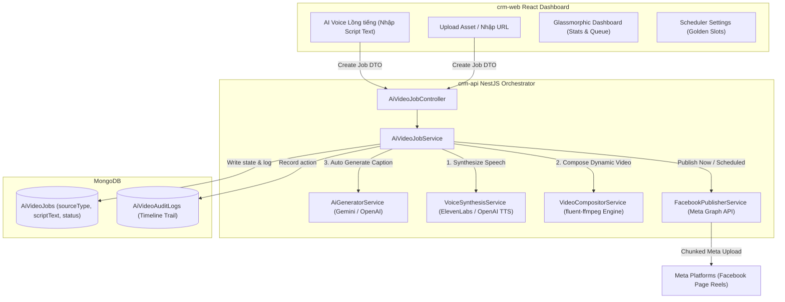

# AI Video Orchestrator & Production Engine System Documentation

Tài liệu này cung cấp cái nhìn chi tiết và toàn diện nhất về hệ thống **AI Video Orchestrator & Auto Production Engine** đã được triển khai tích hợp thành công trên cả Backend (`crm-api`) và Frontend (`crm-web`), cấu trúc kiến trúc, hướng dẫn cấu hình khóa API (Config Keys) và cơ chế vận hành của động cơ dựng video tự động.

---

## 🏛️ 1. Tổng quan Kiến trúc Hệ thống mới nhất (Phase 1 & Phase 2)

Hệ thống hoạt động theo mô hình **DDD-Light (Domain-Driven Design)**, hỗ trợ đa tenant (Multi-tenancy). Điểm đột phá là hệ thống không chỉ còn là bộ điều phối đăng bài (Orchestrator) mà đã trở thành một **Nhà máy sản xuất Video Reels AI khép kín (AI Video Production Engine)**.



---

## ⚙️ 2. Hướng dẫn Cấu hình Khóa API (Config Keys)

Hệ thống AI Video được vận hành tự động thông qua các biến môi trường được cấu hình an toàn trong tệp `.env` của Backend (`crm-api`).

### 2.1 Các biến cấu hình chính trong `.env`
Để kích hoạt đầy đủ các tính năng AI, hãy bổ sung các dòng cấu hình sau vào tệp `.env` của bạn:

```env
# ── AI API KEYS ───────────────────────────────────────────────────────
OPENAI_API_KEY=sk-proj-XXXXXXXXXXXXXXXXXXXXXXXXXXXXXXXXXXXXXXXXXXXXXXXX
GEMINI_API_KEY=AIzaSyXXXXXXXXXXXXXXXXXXXXXXXXXXXXXXXXXXXXXXXXXXXXXXXX

# ── VOICE SYNTHESIS CONFIG (ElevenLabs) ────────────────────────────────
ELEVENLABS_API_KEY=el-key-XXXXXXXXXXXXXXXXXXXXXXXXXXXXXXXXXXXXXXXXXXXX
ELEVENLABS_VOICE_ID=21m00Tcm4TlvDq8ikWAM   # Giọng nói mặc định (Rachel, Adam, etc.)

# ── VIDEO COMPOSITOR PATHS ────────────────────────────────────────────
BGM_PATH=e:/CRM/crm-api/assets/bgm/soft-acoustic.mp3
BG_SLIDE_PATH=e:/CRM/crm-api/assets/images/crm-slide.jpg
```

### 2.2 Cơ chế Fallback & Resilience bền bỉ:
1. **Generative AI Engine (Caption & Hashtags):**
   * Ưu tiên gọi **Gemini 1.5 Flash** hoặc **OpenAI GPT-4o-mini** để tự động sinh bài viết và hashtags.
   * Nếu không có API Keys, hệ thống kích hoạt **Heuristic Generative AI Engine Fallback** tự sinh nội dung nháp cực đỉnh theo 5+ chủ đề kinh doanh (CRM, Tech, Marketing, Sales, Education) không lo gián đoạn.
2. **AI Voice Synthesis:**
   * Hệ thống ưu tiên gọi **ElevenLabs Voice Synthesis API** để tạo giọng đọc tự nhiên.
   * Nếu ElevenLabs hết quota hoặc lỗi, hệ thống tự động fallback sang **OpenAI Text-to-Speech API** (model `tts-1` giọng `alloy`).
   * Nếu cả hai đều lỗi, hệ thống tự động sinh một **MP3 Silence Frame** an toàn để video vẫn được render thành công mà không gây crash pipeline.

---

## 🎥 3. Động cơ Dựng Video Tự động (Video Compositor Engine)

Dịch vụ `VideoCompositorService` sử dụng thư viện **FFmpeg** thông qua `fluent-ffmpeg` để tự động sản xuất video đứng chuẩn Reels:

1. **Chuẩn hóa Đầu vào:**
   * Tự động scale hình ảnh background về kích thước **1080x1920 (Vertical 9:16)**.
2. **Mix Âm thanh & Lặp:**
   * Ghép nối file giọng nói AI vừa được sinh ra.
   * Tính toán thời lượng giọng nói chính xác, sau đó tự động **cắt và lặp nhạc nền (BGM)** nhẹ nhàng ở âm lượng nhỏ hơn (ví dụ: giảm xuống còn 15% âm lượng) để làm nổi bật giọng nói.
3. **Mã hóa Codec chuẩn Meta:**
   * Render video sử dụng định dạng container `.mp4`, codec hình ảnh **H.264** (`libx264`) và codec âm thanh **AAC** (`aac`), cam kết tương thích 100% với Facebook Reels và hiển thị mượt mà trên di động.

---

## 💻 4. Giao diện Quản trị React Admin Dashboard

Giao diện trên `crm-web` được tích hợp các tính năng cao cấp của Phase 2:
1. **Hỗ trợ Tạo Job từ kịch bản AI:**
   * Cho phép chọn Source Type: **"AI Voice Lồng tiếng"** (`script_production`).
   * Tự động chuyển đổi giao diện, ẩn trường URL và hiển thị Textarea rộng rãi để nhập kịch bản văn bản.
2. **Hiển thị Chi tiết kịch bản:**
   * Trong Drawer chi tiết của Job, nếu video được sản xuất từ kịch bản, hệ thống sẽ hiển thị một khung Monospace cực kỳ chuyên nghiệp và trực quan hiển thị lại kịch bản lồng tiếng, giúp người quản trị dễ dàng duyệt nội dung trước khi bấm đăng.
