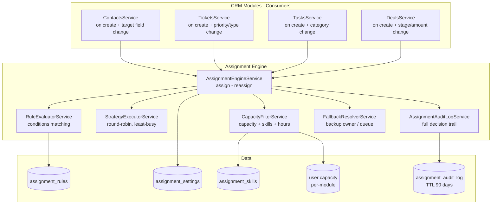
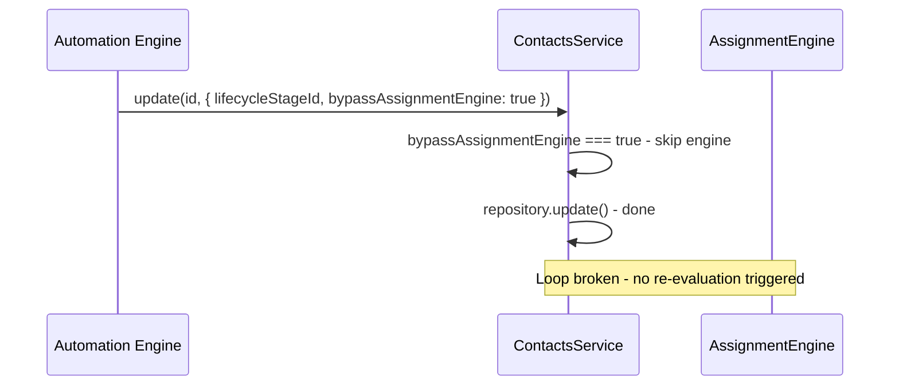

# Unified Assignment Engine — Enterprise CRM Entity Routing

## 1. Bối cảnh & Mục tiêu

### Problem Statement
Các module CRM (Contact, Ticket, Task, Deal) hiện **không có logic routing/auto-assignment** — `ownerId` được set thủ công. Với Enterprise scale (1000+ ticket/task/ngày), manual triage là bất khả thi.

### Business Value
| Giá trị                    | Mô tả                                                     |
| -------------------------- | --------------------------------------------------------- |
| **Operational Efficiency** | Giảm manual triage, auto-assign đúng người                |
| **Accountability**         | Không có orphan data — mỗi entity luôn có owner           |
| **Speed to Lead/Support**  | Gán đúng người, đúng lúc → tăng conversion & satisfaction |
| **Workload Balance**       | Manager nhìn thấy tải công việc, hệ thống tự cân bằng     |
| **Competency Matching**    | Gán entity theo kỹ năng, không phải random round-robin    |

### Rủi ro cần xử lý
| Rủi ro                                       | Mitigation                                                       |
| -------------------------------------------- | ---------------------------------------------------------------- |
| Race condition round-robin ở scale lớn       | Redis atomic counter (INCR), scoped per module+team              |
| Performance khi evaluate hàng trăm rules     | Rules sorted by priority, short-circuit on first match, DB index |
| Gán sai người (Junior nhận $1M Deal)         | Capacity + Skills filtering trước khi apply strategy             |
| **Infinite loop (Automation ↔ Engine)**      | `bypassAssignmentEngine` flag trên mọi UpdateDto                 |
| **Audit log phình to (triệu records/tháng)** | TTL Index 90 ngày trên `createdAt`                               |
| **Skills free-text mismatch**                | Managed `assignment_skills` collection, normalized matching      |

---

## 2. Architecture — Centralized Assignment Engine

### Design Principles
1. **Routing là Lifecycle** — không chỉ gán ID, mà là chu kỳ: Assign → Re-evaluate → Escalate → Fallback
2. **Capacity + Skills** — CRM entities cần Competency-based routing, khác Omni-chat cần Presence-based
3. **Centralized Engine** — DRY, single command center cho admin
4. **Trigger-based Re-evaluation** — chỉ re-evaluate khi target fields thay đổi, không mỗi update
5. **Loop Prevention** — `bypassAssignmentEngine` flag ngắt vòng lặp Automation ↔ Engine

### Separation of Concerns

```
┌─────────────────────────────────────────────────────────┐
│         OMNI-CHANNEL ROUTING (existing)                 │
│                                                         │
│  Scope: Conversation → Agent (Real-time)                │
│  Trigger: Inbound message                               │
│  Features: Presence, Sticky, Wait-time, SLA             │
│  Cần: Agent ĐANG ONLINE                                 │
│  Location: /settings/omni-channel/routing               │
│                                                         │
│  → Giữ nguyên, delegate strategy logic sang shared svc  │
└─────────────────────────────────────────────────────────┘

┌─────────────────────────────────────────────────────────┐
│         ASSIGNMENT ENGINE (new)                          │
│                                                         │
│  Scope: CRM Entity → Owner (Business-rule based)        │
│  Trigger: Entity create + target field change            │
│  Features: Rules, Capacity, Skills, Working Hours,       │
│            Fallback, Sticky (Omni→CRM), Audit log        │
│  Cần: Agent CÓ NĂNG LỰC & CAPACITY                    │
│  Location: /settings/assignment                         │
└─────────────────────────────────────────────────────────┘
```

### Module Architecture



---

## 3. Proposed Changes

### Phase 1: Assignment Engine Core (Backend)

---

#### [NEW] `src/assignment-engine/assignment-engine.module.ts`
Central NestJS module. Imports MongooseModule for schemas, exports service.

#### [NEW] `src/assignment-engine/assignment-engine.service.ts`
Main orchestrator:

```typescript
/** Context built by each CRM module before calling assign() */
interface AssignmentContext {
  module: 'Contact' | 'Ticket' | 'Task' | 'Deal';
  tenantId: string;
  entityId?: string;  // empty on create, populated on re-evaluate
  /** Entity attributes to match against rule conditions */
  attributes: Record<string, any>;
  /** Manual override — skip engine, use this owner */
  manualOwnerId?: string;
  /** Sticky: prioritize current owner of related entity (Omni→CRM) */
  currentOwnerHint?: string;
  /** Loop prevention: skip engine when called from Automation/Engine itself */
  bypassAssignmentEngine?: boolean;
}

interface AssignmentResult {
  ownerId: string | null;
  ruleMatched?: { id: string; name: string };
  strategy: string;
  reason: string;
  fallback: boolean;
}
```

**Flow (assign):**
```
0. bypassAssignmentEngine === true? → return immediately (loop prevention)
1. manualOwnerId set? → return immediately (manual override)
2. Load assignment settings for module
3. autoAssignEnabled === false? → return null (manual mode)
4. Evaluate rules (priority order, first match wins)
5. Resolve candidate pool:
   a. Rule matched with assignToUserId? → direct assignment
   b. Rule matched with assignToTeamId? → resolve team members
   c. No rule matched? → use default team from settings
6. Filter candidates:
   a. Working hours check (isWithinWorkingHours)
   b. Capacity check (activeEntityCount < maxCapacity)
   c. Skills check (user.skills ⊇ rule.requiredSkills, matched by apiName)
   d. Sticky hint: boost priority of currentOwnerHint (if in pool)
7. Apply strategy on filtered pool → pick ownerId
8. Fallback: if no candidate survives filtering → fallback owner
9. Write audit log
10. Return result
```

**Flow (reassign — trigger-based re-evaluation):**
```
1. Compare changed fields against rule condition fields
2. If no overlap → skip (no re-evaluation needed)
3. Run assign() flow
4. If new ownerId ≠ current ownerId → update entity (with bypassAssignmentEngine: true)
5. Audit log with reason: "Re-evaluated: priority LOW→URGENT"
```

#### [NEW] `src/assignment-engine/services/capacity-filter.service.ts`

```typescript
interface UserCapacityInfo {
  userId: string;
  module: string;
  maxCapacity: number;       // e.g., 50 active deals
  currentLoad: number;       // e.g., 32 active deals
  skills: string[];          // normalized apiName from assignment_skills collection
  isWithinWorkingHours: boolean;
  isOutOfOffice: boolean;
}

class CapacityFilterService {
  /** Filter candidates by capacity + skills + availability */
  async filterEligible(
    tenantId: string,
    module: string,
    candidateIds: string[],
    requiredSkills?: string[],
  ): Promise<string[]>;

  /** Count active (non-terminal) entities owned by user for module */
  async getActiveLoad(tenantId: string, userId: string, module: string): Promise<number>;
}
```

Phase 1: Lightweight capacity = `count(active entities) < maxCapacity`
Future: Weighted capacity (Deal $1M = weight 3)

#### [NEW] `src/assignment-engine/services/strategy-executor.service.ts`
Shared strategy logic — reusable by both Assignment Engine and Omni-Channel:

```typescript
class StrategyExecutorService {
  /** Round-robin with Redis atomic counter, scoped by module+team */
  async roundRobin(scope: string, candidates: string[]): Promise<string>;

  /** Pick candidate with fewest active entities */
  async leastBusy(tenantId: string, module: string, candidates: string[]): Promise<string>;
}
```

Redis key format: `assign:rr:{tenantId}:{module}:{teamId}` → atomic INCR

#### [NEW] `src/assignment-engine/services/fallback-resolver.service.ts`

```typescript
class FallbackResolverService {
  /**
   * When no candidate survives filtering:
   * 1. Check fallbackOwnerId in settings → assign
   * 2. Check team manager → assign
   * 3. Return null (entity goes to "Unassigned" queue)
   */
  async resolve(tenantId: string, module: string): Promise<string | null>;
}
```

#### [NEW] `src/assignment-engine/entities/assignment-rule.schema.ts`

```typescript
@Schema({ timestamps: true, collection: 'assignment_rules' })
class AssignmentRuleSchemaClass {
  tenant: string;
  module: 'Contact' | 'Ticket' | 'Task' | 'Deal';
  name: string;
  priority: number;          // lower = higher priority
  matchType: 'all' | 'any';  // AND vs OR
  conditions: [{
    field: string;            // module-specific: 'source', 'priority', 'amount', etc.
    operator: 'eq' | 'neq' | 'contains' | 'in' | 'gt' | 'lt' | 'between';
    value: string;
  }];
  actions: {
    assignToUserId?: string;   // Direct user assignment
    assignToTeamId?: string;   // Team → strategy picks user
    strategy: 'round-robin' | 'least-busy' | 'manual';
    requiredSkills?: string[]; // apiName refs → assignment_skills collection
  };
  enabled: boolean;
}

// Indexes
{ tenant: 1, module: 1, priority: 1 }
{ tenant: 1, module: 1, enabled: 1 }
```

#### [NEW] `src/assignment-engine/entities/assignment-setting.schema.ts`

```typescript
@Schema({ timestamps: true, collection: 'assignment_settings' })
class AssignmentSettingSchemaClass {
  tenant: string;
  module: 'Contact' | 'Ticket' | 'Task' | 'Deal';

  // Core
  autoAssignEnabled: boolean;
  defaultStrategy: 'round-robin' | 'least-busy' | 'manual';
  defaultTeamId?: string;

  // Capacity
  defaultMaxCapacity: number;  // default per-user cap for this module

  // Sticky (Omni → CRM integration)
  prioritizeCurrentOwner: boolean;  // Q1: when related convo has an agent

  // Re-evaluation
  triggerFields: string[];  // Q2: fields that trigger re-evaluation
  // e.g., Contact: ['sourceId', 'lifecycleStageId']
  // e.g., Ticket: ['priority', 'typeId', 'categoryId']

  // Fallback
  fallbackOwnerId?: string;  // Q3: backup owner when no candidate

  // Working Hours
  respectWorkingHours: boolean;
}

// Index
{ tenant: 1, module: 1 } unique
```

#### [NEW] `src/assignment-engine/entities/assignment-audit-log.schema.ts`

```typescript
@Schema({ timestamps: true, collection: 'assignment_audit_logs' })
class AssignmentAuditLogSchemaClass {
  tenant: string;
  module: string;
  entityId: string;
  assignedUserId: string | null;
  previousOwnerId?: string;
  ruleId?: string;
  ruleName?: string;
  strategy: string;
  reason: string;
  candidatesEvaluated: number;
  candidatesFiltered: number;
  isFallback: boolean;
  isReassignment: boolean;
  triggerField?: string;  // which field change triggered re-eval
  metadata: Record<string, any>;
}

// TTL Index — auto-delete after 90 days (7,776,000 seconds)
// Prevents unbounded growth at enterprise scale (1000+ entities/day)
AuditLogSchema.index({ createdAt: 1 }, { expireAfterSeconds: 7776000 });
```

#### [NEW] `src/assignment-engine/entities/assignment-skill.schema.ts`
Managed skill tags — prevents free-text mismatch ("English" vs "english"):

```typescript
@Schema({ timestamps: true, collection: 'assignment_skills' })
class AssignmentSkillSchemaClass {
  tenant: string;
  name: string;       // display: "English", "Kỹ thuật mạng"
  apiName: string;    // normalized: "english", "ky_thuat_mang"
  category?: string;  // optional grouping: "Language", "Technical"
}

// Index
{ tenant: 1, apiName: 1 } unique
```

> Skills are matched by `apiName` (case-insensitive, normalized). Admin manages skills via API, users are tagged via User Management. Rule conditions reference `apiName`, not free-text.

#### [NEW] `src/assignment-engine/assignment-engine.controller.ts`

| Method   | Path                                               | Description                      |
| -------- | -------------------------------------------------- | -------------------------------- |
| `GET`    | `/assignment-engine/settings/:module`              | Get module assignment settings   |
| `PUT`    | `/assignment-engine/settings/:module`              | Save module settings             |
| `GET`    | `/assignment-engine/rules?module=X`                | List rules (filtered by module)  |
| `POST`   | `/assignment-engine/rules`                         | Create rule                      |
| `PATCH`  | `/assignment-engine/rules/:id`                     | Update rule                      |
| `DELETE` | `/assignment-engine/rules/:id`                     | Delete rule                      |
| `POST`   | `/assignment-engine/rules/reorder`                 | Reorder rules                    |
| `POST`   | `/assignment-engine/dry-run`                       | **Dry Run**: simulate assignment |
| `GET`    | `/assignment-engine/audit-log?module=X&entityId=Y` | Query audit log                  |
| `GET`    | `/assignment-engine/skills`                        | List managed skills              |
| `POST`   | `/assignment-engine/skills`                        | Create skill tag                 |
| `DELETE` | `/assignment-engine/skills/:id`                    | Delete skill tag                 |

**Dry Run API:**
```typescript
// POST /assignment-engine/dry-run
{
  module: 'Ticket',
  attributes: { priority: 'urgent', typeId: '...', categoryId: '...' }
}
// Response:
{
  wouldAssignTo: { userId: '...', name: 'Nguyen Van A' },
  ruleMatched: { id: '...', name: 'Urgent → Senior Team' },
  strategy: 'least-busy',
  candidatesEvaluated: 8,
  candidatesSurvived: 3,
  reason: 'Rule "Urgent → Senior Team" matched, least-busy selected agent with 5 active tickets'
}
```

---

### Phase 2: Integrate vào CRM Modules

#### Module-specific Condition Fields

| Module      | Condition Fields                              | Trigger Fields (re-eval)       |
| ----------- | --------------------------------------------- | ------------------------------ |
| **Contact** | `sourceId`, `lifecycleStageId`, `tags`        | `sourceId`, `lifecycleStageId` |
| **Ticket**  | `priority`, `typeId`, `categoryId`, `channel` | `priority`, `typeId`           |
| **Task**    | `priority`, `categoryId`, `relatedToType`     | `priority`, `categoryId`       |
| **Deal**    | `pipelineId`, `stageId`, `amount`, `sourceId` | `stageId`, `amount`            |

#### [MODIFY] `src/contacts/contacts.service.ts`
```diff
 async create(data: CreateContactDto): Promise<Contact> {
   let ownerId = data.ownerId === '' ? undefined : data.ownerId;
+
+  // Auto-assign via Assignment Engine
+  if (!ownerId) {
+    const result = await this.assignmentEngine.assign({
+      module: 'Contact',
+      tenantId: this.cls.get('tenantId'),
+      attributes: {
+        sourceId: data.sourceId,
+        lifecycleStageId: data.lifecycleStageId,
+        tags: data.tags,
+      },
+    });
+    ownerId = result.ownerId ?? undefined;
+  }
+
   return this.repository.create({ ...data, ownerId } as any);
 }

+async update(id: string, data: UpdateContactDto): Promise<Contact | null> {
+  // Loop prevention: skip engine when called from Automation or Engine itself
+  if (data.bypassAssignmentEngine) {
+    return this.repository.update(id, data);
+  }
+
+  // Trigger-based re-evaluation
+  if (data.sourceId || data.lifecycleStageId) {
+    const existing = await this.findOne(id);
+    if (existing) {
+      const result = await this.assignmentEngine.reassign({
+        module: 'Contact',
+        tenantId: this.cls.get('tenantId'),
+        entityId: id,
+        currentOwnerId: existing.ownerId,
+        changedFields: Object.keys(data),
+        attributes: { ...existing, ...data },
+      });
+      // Engine updates ownerId with bypass flag to prevent loop
+      if (result.ownerId && result.ownerId !== existing.ownerId) {
+        data.ownerId = result.ownerId;
+      }
+    }
+  }
+  ...
+}
```

> [!WARNING]
> **All CRM UpdateDTOs** (`UpdateContactDto`, `UpdateTicketDto`, `UpdateTaskDto`, `UpdateDealDto`) **must add** `bypassAssignmentEngine?: boolean` field. Any system-initiated update (Automation rules, Assignment Engine itself) sets this flag to `true`.

#### [MODIFY] `src/tickets/tickets.service.ts`
Same pattern. Trigger re-eval on `priority` or `typeId` change.

#### [MODIFY] `src/tasks/tasks.service.ts`
Same pattern. Trigger re-eval on `priority` or `categoryId` change.

#### [MODIFY] `src/deals/deals.service.ts`
Same pattern. Trigger re-eval on `stageId` or `amount` change.

---

### Phase 3: Refactor Omni-Channel Shared Strategies

#### [MODIFY] `src/omni-inbound/services/assignment.service.ts`
- Extract `roundRobin()`, `leastBusy()` → shared `StrategyExecutorService`
- `AssignmentService` keeps omni-specific logic (presence, sticky wait-time, capacity-based with real-time load)
- Delegates pure strategy execution to shared service

---

### Phase 4: Frontend Settings UI

#### [NEW] `crm-web/src/features/settings/ui/assignment/AssignmentSettingsPage.tsx`
Settings page at `/settings/assignment` with module tabs:

```
┌──────────────────────────────────────────────────────┐
│  Assignment Engine Settings                          │
├──────────┬──────────┬──────────┬──────────┬─────────┤
│ Contact  │ Ticket   │  Task    │  Deal    │ Audit   │
├──────────┴──────────┴──────────┴──────────┴─────────┤
│                                                      │
│  ┌─ Master Toggle ─────────────────────────────────┐│
│  │ 🟢 Auto-Assignment: ENABLED                     ││
│  └──────────────────────────────────────────────────┘│
│                                                      │
│  ┌─ Default Config ────────────────────────────────┐│
│  │ Strategy: [Round-robin ▾]  Team: [Sales ▾]      ││
│  │ Max Capacity: [50] per user                     ││
│  │ ☑ Respect Working Hours                         ││
│  │ ☑ Prioritize Current Owner (Omni→CRM)           ││
│  │ Fallback Owner: [Manager Name ▾]                ││
│  └──────────────────────────────────────────────────┘│
│                                                      │
│  ┌─ Re-evaluation Triggers ────────────────────────┐│
│  │ Fields: [priority] [typeId] [categoryId]        ││
│  └──────────────────────────────────────────────────┘│
│                                                      │
│  ┌─ Rules ─────────────────────────────────────────┐│
│  │ #1 IF priority = urgent AND type = bug          ││
│  │    THEN → Senior Engineering (least-busy)       ││
│  │         Required Skills: [networking] [linux]   ││
│  │                                                  ││
│  │ #2 IF source = partner_referral                 ││
│  │    THEN → Enterprise Sales (round-robin)        ││
│  │         Required Skills: [english] [enterprise] ││
│  │                                                  ││
│  │ [+ Add Rule]                                    ││
│  └──────────────────────────────────────────────────┘│
│                                                      │
│  ┌─ 🧪 Dry Run ───────────────────────────────────┐│
│  │ [Select attributes...] [▶ Simulate]             ││
│  │ Result: → Nguyen Van A (Rule #1, least-busy)    ││
│  │          8 evaluated → 3 survived filtering      ││
│  └──────────────────────────────────────────────────┘│
└──────────────────────────────────────────────────────┘
```

#### [NEW] `crm-web/src/features/settings/services/assignmentEngineApi.ts`
API client for all assignment engine endpoints.

#### [MODIFY] Routes
Add `/settings/assignment` route under Settings layout.

---

## 4. Implementation Phases & Priority

| Phase       | Scope                                                                                                                                 | Priority | Effort   |
| ----------- | ------------------------------------------------------------------------------------------------------------------------------------- | -------- | -------- |
| **Phase 1** | Engine core: schemas (rules, settings, audit log, skills), evaluator, capacity filter, strategies, fallback, dry-run, loop prevention | P0       | 3-4 days |
| **Phase 2** | Integrate 4 CRM modules (create + re-evaluate + bypassAssignmentEngine)                                                               | P0       | 2 days   |
| **Phase 3** | Refactor Omni-Channel shared strategies                                                                                               | P1       | 1 day    |
| **Phase 4** | Frontend Settings UI + Dry Run + Skills Management                                                                                    | P1       | 2-3 days |
| **Future**  | Weighted capacity, Escalation chains, SLA integration                                                                                 | P2       | —        |

---

## 5. Production Safeguards

### 5.1 Loop Prevention

**Problem**: Automation rule "Owner changes → Update Lifecycle Stage" triggers re-evaluation → new owner assigned → stage update → infinite loop.

**Solution**: `bypassAssignmentEngine?: boolean` flag on all UpdateDTOs and AssignmentContext.



### 5.2 Audit Log Data Retention

**Problem**: 1000+ entities/day x re-evaluations = millions of records/month.

**Solution**: MongoDB TTL Index — auto-delete after 90 days.

```typescript
// assignment-audit-log.schema.ts
AuditLogSchema.index({ createdAt: 1 }, { expireAfterSeconds: 7776000 }); // 90 days
```

### 5.3 Skills Master Data

**Problem**: Free-text skills cause mismatches ("English" vs "english" vs "Tieng Anh").

**Solution**: Managed `assignment_skills` collection with normalized `apiName`.

| Field     | Example                    |
| --------- | -------------------------- |
| `name`    | "English", "Ky thuat mang" |
| `apiName` | "english", "ky_thuat_mang" |

- Rule conditions reference `apiName` (auto-generated, unique per tenant)
- User skills are `apiName[]` tags (not free-text input)
- CapacityFilter matches by `apiName` (case-insensitive comparison built-in)
- Admin manages skills via `/assignment-engine/skills` CRUD API
- Settings UI: skill selector dropdown (not text input)

**Prerequisite**: User schema already has `skills: string[]` field. Phase 1 adds the managed skill collection; User Management UI adds skill tag selector.

---

## 6. Verification Plan

### Automated Tests
- Unit tests: `AssignmentEngineService.assign()` — no rules match, rule match → team, direct user, capacity exceeded → fallback
- Unit tests: `CapacityFilterService` — filter by capacity, skills, working hours
- Unit tests: `StrategyExecutorService` — round-robin counter, least-busy selection
- Unit tests: Re-evaluation trigger detection + loop prevention (bypass flag)
- Unit tests: Skill matching with normalized apiName
- `npx nest build` — 0 errors

### Manual Verification
- Create Contact without owner → verify auto-assign works
- Create Ticket priority=URGENT → rule matches Senior Team → correct ownerId
- Agent at max capacity → skipped, next agent selected
- Out-of-office agent → skipped
- No candidates → fallback owner assigned
- Dry Run: simulate with test attributes → correct prediction
- Audit log: full decision trail visible
- **Loop test**: Simulate Automation update with bypass flag → no re-evaluation
- **TTL test**: Verify old audit logs auto-deleted after expiry
- **Skills test**: Create skill, assign to user, create rule with requiredSkills → correct matching

### Performance
- Benchmark rule evaluation with 100 rules x 1000 concurrent creates
- Verify Redis round-robin has no race conditions under load
- Verify audit log query performance with TTL index active
