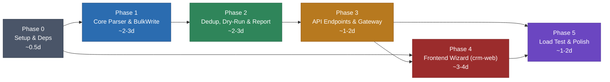

# Kế hoạch triển khai Contact Import — Phân chia Phase & Task

Dựa trên đặc tả [15-contact-import.md](file:///e:/CRM/crm-api/docs/15-contact-import.md).

**Tech Stack tham chiếu:**
- **Backend** (`crm-api`): NestJS, BullMQ, MongoDB, Redis Pub/Sub
- **Frontend** (`crm-web`): React 19 + Vite + TypeScript, Tailwind CSS v4, Radix UI, TanStack React Query, Zustand, react-hook-form + Zod, react-i18next (en/vi), socket.io-client, Sonner (toast)

**Ước lượng tổng: ~8-12 ngày làm việc.**

---

## Phase 0 — Setup & Dependencies (~0.5 ngày)

> Chuẩn bị hạ tầng, cài đặt thư viện, tạo constants và DTO.

| #   | Task                                           | File                                                                               | Loại    | Ghi chú                                                                                                |
| --- | ---------------------------------------------- | ---------------------------------------------------------------------------------- | ------- | ------------------------------------------------------------------------------------------------------ |
| 0.1 | Cài đặt dependencies `csv-parser` và `exceljs` | `crm-api/package.json`                                                             | SỬA     | `npm install csv-parser exceljs`                                                                       |
| 0.2 | Thêm constant `CONTACT_IMPORT_QUEUE`           | [contacts.constants.ts](file:///e:/CRM/crm-api/src/contacts/contacts.constants.ts) | SỬA     | `export const CONTACT_IMPORT_QUEUE = 'contact-import'`                                                 |
| 0.3 | Tạo `StartImportDto` với validation            | `crm-api/src/contacts/dto/start-import.dto.ts`                                     | TẠO MỚI | `fileKey` required, `mapping` phải có `firstName` + `lastName`, `matchingFields ⊆ ['emails','phones']` |
| 0.4 | Tạo `ImportJobStatusDto` (response)            | `crm-api/src/contacts/dto/import-job-status.dto.ts`                                | TẠO MỚI | `status`, `progress`, `summary`, `reportUrl`                                                           |
| 0.5 | Đăng ký Import Queue trong module              | [contacts.module.ts](file:///e:/CRM/crm-api/src/contacts/contacts.module.ts)       | SỬA     | `BullModule.registerQueue(...)` — `attempts:1`, `timeout:30min`, `removeOnComplete:50`                 |

**✅ Tiêu chí hoàn thành**: Build thành công, queue hiện trên Bull Board.

---

## Phase 1 — Core Backend: Stream Parser & BulkWrite (~2-3 ngày)

> Xây dựng core import logic: stream parse file → batch → ghi DB.

| #    | Task                                                   | File                                                                         | Loại    | Ghi chú                                                                                             |
| ---- | ------------------------------------------------------ | ---------------------------------------------------------------------------- | ------- | --------------------------------------------------------------------------------------------------- |
| 1.1  | Tạo interface `IImportParser`                          | `crm-api/src/contacts/import/import-parser.interface.ts`                     | TẠO MỚI | `parse(stream): AsyncIterable<Record<string,string>>`, `countRows(stream): Promise<number>`         |
| 1.2  | Implement `CsvImportParser`                            | `crm-api/src/contacts/import/csv-import-parser.ts`                           | TẠO MỚI | Dùng `csv-parser`, true streaming                                                                   |
| 1.3  | Implement `XlsxImportParser`                           | `crm-api/src/contacts/import/xlsx-import-parser.ts`                          | TẠO MỚI | Dùng `exceljs` streaming API. Cảnh báo nếu > 50k dòng                                               |
| 1.4  | Tạo `ContactImportProcessor` (BullMQ worker)           | `crm-api/src/contacts/contact-import.processor.ts`                           | TẠO MỚI | Kế thừa `BaseTenantConsumer`. Luồng: stream → gom batch 1000 → mapping → `bulkWrite(ordered:false)` |
| 1.5  | Implement logic áp dụng field mapping                  | Trong `ContactImportProcessor`                                               | —       | Map header sang Contact field. Populate `tenantId`, `createdById`, `updatedById` từ `job.data`      |
| 1.6  | Implement batch `bulkWrite` ordered:false              | Trong `ContactImportProcessor`                                               | —       | Build `insertOne` ops → `bulkWrite`. Bắt lỗi per-document                                           |
| 1.7  | Implement progress tracking                            | Trong `ContactImportProcessor`                                               | —       | `Math.floor((processed / total) * 100)` → `job.updateProgress()`. Cap 99%, set 100% sau report      |
| 1.8  | Stream resource cleanup (`try/finally`)                | Trong `ContactImportProcessor`                                               | —       | `stream.destroy()` trong `finally` — tránh memory leak                                              |
| 1.9  | Throttle delay giữa các batch                          | Trong `ContactImportProcessor`                                               | —       | `await delay(50-100ms)` — tránh quá tải MongoDB CPU                                                 |
| 1.10 | Đăng ký `ContactImportProcessor` vào `workerProviders` | [contacts.module.ts](file:///e:/CRM/crm-api/src/contacts/contacts.module.ts) | SỬA     | Nằm trong mảng conditional `isWorkerRuntime()`, **KHÔNG** vào `providers` thường                    |

**✅ Tiêu chí hoàn thành**: Worker stream parse CSV 10k dòng → insert MongoDB thành công. Progress cập nhật trên Bull Board.

---

## Phase 2 — Deduplication, Dry-Run & Report (~2-3 ngày)

> Xử lý trùng lặp theo policy, chế độ dry-run, và sinh báo cáo lỗi.

| #    | Task                                   | File                                                                           | Loại    | Ghi chú                                                                                                                           |
| ---- | -------------------------------------- | ------------------------------------------------------------------------------ | ------- | --------------------------------------------------------------------------------------------------------------------------------- |
| 2.1  | Implement dedup query batch bằng `$in` | Trong `ContactImportProcessor`                                                 | —       | Query contacts hiện có theo `emails`/`phones` (compound index). Resolve dedup in-memory                                           |
| 2.2  | Implement policy **`skip`**            | Trong `ContactImportProcessor`                                                 | —       | Trùng → bỏ qua, ghi skipped count                                                                                                 |
| 2.3  | Implement policy **`overwrite`**       | Trong `ContactImportProcessor`                                                 | —       | Trùng → `updateOne` ghi đè toàn bộ mapped fields                                                                                  |
| 2.4  | Implement policy **`merge`**           | Trong `ContactImportProcessor`                                                 | —       | Append array (emails/phones), fill trống, giữ nguyên có. Tôn trọng `multipleEmailsAllowed`/`multiplePhonesAllowed`                |
| 2.5  | Đọc tenant settings lúc enqueue        | [contacts.service.ts](file:///e:/CRM/crm-api/src/contacts/contacts.service.ts) | SỬA     | `CrmSettingsService` → serialize vào `job.data.tenantSettings`                                                                    |
| 2.6  | Implement Dry-Run mode                 | Trong `ContactImportProcessor`                                                 | —       | `dryRun: true` → parse + validate + dedup, **KHÔNG** `bulkWrite`. Trả `{ wouldInsert, wouldUpdate, wouldSkip, validationErrors }` |
| 2.7  | Tạo `ContactImportReportService`       | `crm-api/src/contacts/contact-import-report.service.ts`                        | TẠO MỚI | Serialize JSON → lưu qua `ContactExportStorageService` (S3/local). Append lỗi theo batch (tránh OOM)                              |
| 2.8  | Report TTL & cleanup                   | Trong `ContactImportReportService`                                             | —       | TTL 24h, cùng cơ chế cleanup export                                                                                               |
| 2.9  | Implement per-tenant Redis Lock        | Trong `ContactImportProcessor`                                                 | —       | `RedisLockService.acquire('lock:contact:import:${tenantId}', 10min)`                                                              |
| 2.10 | Concurrency global                     | `contact-import.processor.ts`                                                  | —       | `@Processor(CONTACT_IMPORT_QUEUE, { concurrency: 3 })`                                                                            |

**✅ Tiêu chí hoàn thành**: 10k dòng, 50% duplicate → dedup chính xác (3 policy). Dry-run zero write. Report JSON downloadable.

---

## Phase 3 — API Endpoints & Real-time Gateway (~1-2 ngày)

> Expose REST endpoints và kết nối WebSocket thông báo real-time.

| #   | Task                                         | File                                                                                 | Loại | Ghi chú                                                                                          |
| --- | -------------------------------------------- | ------------------------------------------------------------------------------------ | ---- | ------------------------------------------------------------------------------------------------ |
| 3.1 | Implement `startImport()` trong service      | [contacts.service.ts](file:///e:/CRM/crm-api/src/contacts/contacts.service.ts)       | SỬA  | Validate mapping, fileKey, đọc tenant settings, enqueue, trả `jobId`                             |
| 3.2 | Implement `getImportStatus()` trong service  | [contacts.service.ts](file:///e:/CRM/crm-api/src/contacts/contacts.service.ts)       | SỬA  | Validate `tenantId`+`userId` khớp, trả `status`, `progress`, `summary`, `reportUrl`              |
| 3.3 | Endpoint `POST /import`                      | [contacts.controller.ts](file:///e:/CRM/crm-api/src/contacts/contacts.controller.ts) | SỬA  | `@Throttle({ limit: 3, ttl: 60_000 })`, `@RequirePermission('create', 'contacts')`, return `202` |
| 3.4 | Endpoint `GET /import-status/:jobId`         | [contacts.controller.ts](file:///e:/CRM/crm-api/src/contacts/contacts.controller.ts) | SỬA  | Security check `tenantId + userId`                                                               |
| 3.5 | Publish Redis event khi hoàn thành           | Trong `ContactImportProcessor`                                                       | —    | `redisPublisher.publish('socket:contact:import:completed', ...)` — theo pattern export           |
| 3.6 | Thêm channel vào OmniGateway                 | [omni.gateway.ts](file:///e:/CRM/crm-api/src/omni-inbound/services/omni.gateway.ts)  | SỬA  | Thêm `'socket:contact:import:completed'` vào `socketEventChannels` + switch case                 |
| 3.7 | Tạo handler `handleContactImportCompleted()` | [omni.gateway.ts](file:///e:/CRM/crm-api/src/omni-inbound/services/omni.gateway.ts)  | SỬA  | Emit tới `agent:${userId}` (không toàn tenant)                                                   |

**✅ Tiêu chí hoàn thành**: `POST /contacts/import` → `202 + jobId`. Poll status → progress realtime. WebSocket event khi hoàn thành.

---

## Phase 4 — Frontend: Multi-step Import Wizard (`crm-web`) (~3-4 ngày)

> Xây dựng giao diện import wizard 6 bước trong `crm-web`.

### Kiến trúc tuân thủ `crm-web`
- **Feature-Sliced Design**: Tất cả nằm trong `src/features/contacts/`
- **API layer**: Thêm methods vào [contactsApi.ts](file:///e:/CRM/crm-web/src/features/contacts/api/contactsApi.ts) (đã có pattern `exportContacts`, `getExportStatus`)
- **WebSocket hook**: Tạo tương tự [useContactExportSocket.ts](file:///e:/CRM/crm-web/src/features/contacts/hooks/useContactExportSocket.ts) (dùng `omniSocketService`)
- **Form validation**: `react-hook-form` + `zod`
- **State**: `@tanstack/react-query` cho server state, `zustand` nếu cần wizard state
- **i18n**: Bắt buộc `useTranslation`, hỗ trợ cả `en` và `vi`
- **UI components**: Radix UI primitives, Tailwind CSS v4, `cn()` utility
- **Router**: `react-router-dom` v7, lazy load + `withSuspense` + `RequirePermission`
- **Toast**: `sonner` (đã cài sẵn)

| #    | Task                                               | File (đường dẫn trong `crm-web/src/`)                        | Loại    | Ghi chú                                                                                                                                                              |
| ---- | -------------------------------------------------- | ------------------------------------------------------------ | ------- | -------------------------------------------------------------------------------------------------------------------------------------------------------------------- |
| 4.1  | Thêm API methods: `startImport`, `getImportStatus` | `features/contacts/api/contactsApi.ts`                       | SỬA     | Thêm vào object `contactsApi` hiện có, cùng pattern với `exportContacts`/`getExportStatus`                                                                           |
| 4.2  | Thêm import types                                  | `features/contacts/types.ts`                                 | SỬA     | `ImportJob`, `ImportStatus`, `ImportSummary`, `ImportConfig` interfaces                                                                                              |
| 4.3  | Tạo route `/contacts/import`                       | `app/router.tsx`                                             | SỬA     | Lazy load `ContactImportPage`, wrap `RequirePermission('create', 'contacts')`, đặt trong children của `contacts`                                                     |
| 4.4  | Tạo wizard page (container)                        | `features/contacts/ui/ContactImportPage.tsx`                 | TẠO MỚI | Multi-step wizard, quản lý step state bằng `useState` hoặc `zustand` store                                                                                           |
| 4.5  | **Bước 1 — FileUploadStep**                        | `features/contacts/components/import/FileUploadStep.tsx`     | TẠO MỚI | Drag & drop (Radix), validate `.csv`/`.xlsx` + max 50MB, upload qua existing `FileModule` API                                                                        |
| 4.6  | **Bước 2 — FieldMappingStep**                      | `features/contacts/components/import/FieldMappingStep.tsx`   | TẠO MỚI | Parse header → Radix Select dropdown map sang Contact fields. Auto-suggest fuzzy. Highlight chưa map (amber) / required (red). Form controlled bởi `react-hook-form` |
| 4.7  | **Bước 3 — ImportConfigStep**                      | `features/contacts/components/import/ImportConfigStep.tsx`   | TẠO MỚI | Radix Radio Group (dedup policy) + Radix Switch (dry-run ON default, automation OFF default) + Radix Tooltip giải thích                                              |
| 4.8  | **Bước 4 — DryRunPreviewStep**                     | `features/contacts/components/import/DryRunPreviewStep.tsx`  | TẠO MỚI | Gọi API `dryRun: true` qua `useMutation`. Hiển thị preview counts. Nút "Import thật" / "Quay lại"                                                                    |
| 4.9  | **Bước 5 — ImportProgressStep**                    | `features/contacts/components/import/ImportProgressStep.tsx` | TẠO MỚI | Progress bar (Tailwind animated). `useQuery` polling mỗi 2s + WebSocket. `beforeunload` warning. Hiển thị "X / Y (Z%)"                                               |
| 4.10 | **Bước 6 — ImportResultStep**                      | `features/contacts/components/import/ImportResultStep.tsx`   | TẠO MỚI | Summary cards. Nút download report (nếu errors > 0). Nút "Xem contacts" → navigate `/contacts`                                                                       |
| 4.11 | Tạo hook `useContactImportSocket`                  | `features/contacts/hooks/useContactImportSocket.ts`          | TẠO MỚI | Tham chiếu pattern `useContactExportSocket.ts`: listen `contact:import:completed` qua `omniSocketService`                                                            |
| 4.12 | Tạo hook `useImportJobStatus`                      | `features/contacts/hooks/useImportJobStatus.ts`              | TẠO MỚI | `useQuery` polling `getImportStatus(jobId)` mỗi 2s + integrate `useContactImportSocket`. Auto-stop polling khi completed/failed                                      |
| 4.13 | Thêm i18n keys cho import                          | `shared/i18n/locales/en/contacts.json` + `vi/contacts.json`  | SỬA     | Keys: `contacts.import.*` — wizard labels, step titles, policy descriptions, error messages, button texts                                                            |
| 4.14 | Xử lý lỗi UX toàn diện                             | Across components                                            | —       | File > 50MB → Sonner toast error. Required fields chưa map → disable "Next". Job failed → hiển thị `failedReason` + retry                                            |

**✅ Tiêu chí hoàn thành**: User flow end-to-end: upload CSV → map fields → config → dry-run preview → import → xem kết quả + download report.

---

## Phase 5 — Load Test, Polish & Documentation (~1-2 ngày)

> Kiểm thử hiệu năng, xử lý edge cases, hoàn thiện.

| #    | Task                                           | File                                               | Loại    | Ghi chú                                                |
| ---- | ---------------------------------------------- | -------------------------------------------------- | ------- | ------------------------------------------------------ |
| 5.1  | Tạo script sinh test data                      | `crm-api/src/scripts/generate-import-test-data.ts` | TẠO MỚI | CSV: 10k (Smoke), 100k (Load), 500k (Stress)           |
| 5.2  | **Load Test A** — Clean Insert 100k            | —                                                  | TEST    | Mục tiêu: < 90s, heap < 500MB                          |
| 5.3  | **Load Test B** — Dedup Merge 100k (50% trùng) | —                                                  | TEST    | Mục tiêu: < 180s                                       |
| 5.4  | **Load Test C** — 5 concurrent × 20k           | —                                                  | TEST    | BullMQ phân phối tốt, không OOM, Redis lock per-tenant |
| 5.5  | Verify index với `explain('executionStats')`   | —                                                  | TEST    | Confirm `IXSCAN`, không `COLLSCAN`                     |
| 5.6  | Monitor memory Worker                          | —                                                  | TEST    | Heap dưới 500MB suốt quá trình                         |
| 5.7  | Unit tests: parse, mapping, dedup rules        | `crm-api/src/contacts/__tests__/`                  | TẠO MỚI | 3 policy, dry-run zero writes, required fields         |
| 5.8  | E2E test: upload → import → verify DB          | `crm-api/test/`                                    | TẠO MỚI | Full flow qua HTTP                                     |
| 5.9  | Manual test: CSV + XLSX qua dashboard          | —                                                  | TEST    | Cả 2 format, progress bar + report download            |
| 5.10 | Manual test: concurrent cùng tenant            | —                                                  | TEST    | Redis lock chặn, không duplicate                       |

**✅ Tiêu chí hoàn thành**: Load test đạt KPI. Unit test pass. Flow hoạt động đúng.

---

## Dependency Graph giữa các Phase

> [!IMPORTANT]
> - **Phase 0 → 1 → 2 → 3** tuần tự (backend pipeline)
> - **Phase 4** (Frontend): có thể bắt đầu skeleton + upload step từ Phase 0 (mock API), nhưng tích hợp thật cần Phase 3
> - **Phase 5** yêu cầu cả backend + frontend sẵn sàng

---

## Tổng hợp file changes

### `crm-api` (Backend) — 9 file

| File                                             | Hành động | Phase |
| ------------------------------------------------ | --------- | ----- |
| `src/contacts/contacts.constants.ts`             | SỬA       | 0     |
| `src/contacts/dto/start-import.dto.ts`           | TẠO MỚI   | 0     |
| `src/contacts/dto/import-job-status.dto.ts`      | TẠO MỚI   | 0     |
| `src/contacts/import/import-parser.interface.ts` | TẠO MỚI   | 1     |
| `src/contacts/import/csv-import-parser.ts`       | TẠO MỚI   | 1     |
| `src/contacts/import/xlsx-import-parser.ts`      | TẠO MỚI   | 1     |
| `src/contacts/contact-import.processor.ts`       | TẠO MỚI   | 1-2   |
| `src/contacts/contact-import-report.service.ts`  | TẠO MỚI   | 2     |
| `src/contacts/contacts.service.ts`               | SỬA       | 2-3   |
| `src/contacts/contacts.controller.ts`            | SỬA       | 3     |
| `src/contacts/contacts.module.ts`                | SỬA       | 0, 1  |
| `src/omni-inbound/services/omni.gateway.ts`      | SỬA       | 3     |

### `crm-web` (Frontend) — 11 file

| File                                                             | Hành động | Phase |
| ---------------------------------------------------------------- | --------- | ----- |
| `src/features/contacts/api/contactsApi.ts`                       | SỬA       | 4     |
| `src/features/contacts/types.ts`                                 | SỬA       | 4     |
| `src/app/router.tsx`                                             | SỬA       | 4     |
| `src/features/contacts/ui/ContactImportPage.tsx`                 | TẠO MỚI   | 4     |
| `src/features/contacts/components/import/FileUploadStep.tsx`     | TẠO MỚI   | 4     |
| `src/features/contacts/components/import/FieldMappingStep.tsx`   | TẠO MỚI   | 4     |
| `src/features/contacts/components/import/ImportConfigStep.tsx`   | TẠO MỚI   | 4     |
| `src/features/contacts/components/import/DryRunPreviewStep.tsx`  | TẠO MỚI   | 4     |
| `src/features/contacts/components/import/ImportProgressStep.tsx` | TẠO MỚI   | 4     |
| `src/features/contacts/components/import/ImportResultStep.tsx`   | TẠO MỚI   | 4     |
| `src/features/contacts/hooks/useContactImportSocket.ts`          | TẠO MỚI   | 4     |
| `src/features/contacts/hooks/useImportJobStatus.ts`              | TẠO MỚI   | 4     |
| `src/shared/i18n/locales/en/contacts.json`                       | SỬA       | 4     |
| `src/shared/i18n/locales/vi/contacts.json`                       | SỬA       | 4     |
