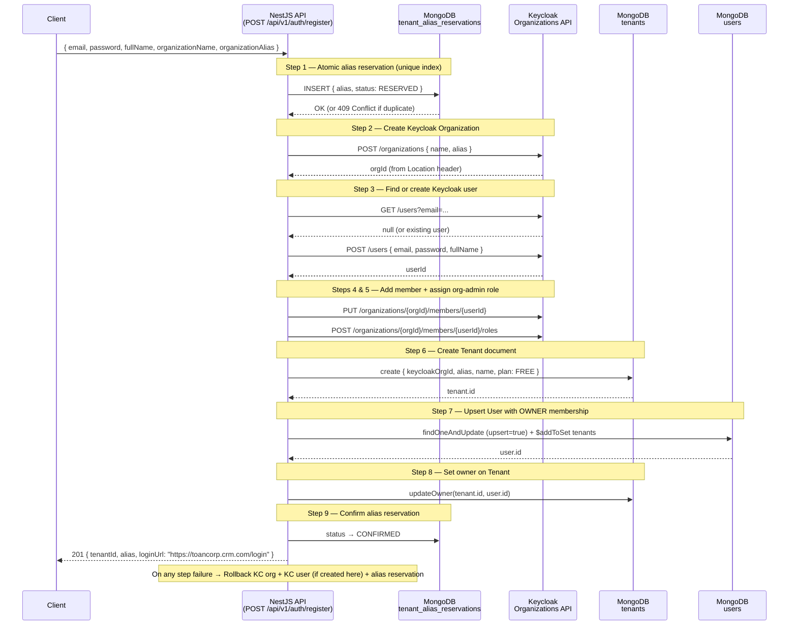

# SaaS Tenant Onboarding — Implementation Walkthrough

## Build Status
✅ `npm run build` — **Exit code 0, 0 errors**

---

## What Was Built

### New Files Created

| File | Purpose |
|---|---|
| [register-tenant.dto.ts](file:///e:/CRM/crm-api/src/tenants/dto/register-tenant.dto.ts) | New DTO for `POST /api/v1/auth/register` |
| [tenant-alias-reservation.schema.ts](file:///e:/CRM/crm-api/src/tenants/infrastructure/persistence/document/entities/tenant-alias-reservation.schema.ts) | `tenant_alias_reservations` collection with unique + TTL indexes |
| [tenant-alias-reservation.repository.ts](file:///e:/CRM/crm-api/src/tenants/infrastructure/persistence/document/repositories/tenant-alias-reservation.repository.ts) | Atomic `reserve()`, `confirm()`, `delete()` |
| [tenant-resolver.middleware.ts](file:///e:/CRM/crm-api/src/tenants/middleware/tenant-resolver.middleware.ts) | Extracts tenant alias from Host header subdomain |

### Modified Files

| File | What Changed |
|---|---|
| [tenant.ts (domain)](file:///e:/CRM/crm-api/src/tenants/domain/tenant.ts) | New fields: `keycloakOrgId`, `alias`, `owner`, `subscriptionPlan`, `status` |
| [tenant.schema.ts](file:///e:/CRM/crm-api/src/tenants/infrastructure/persistence/document/entities/tenant.schema.ts) | Schema updated to match new domain (with unique indexes) |
| [tenant.mapper.ts](file:///e:/CRM/crm-api/src/tenants/infrastructure/persistence/document/mappers/tenant.mapper.ts) | Updated to handle all new fields |
| [tenant.repository.ts](file:///e:/CRM/crm-api/src/tenants/infrastructure/persistence/document/repositories/tenant.repository.ts) | Added `findByAlias`, `findByKeycloakOrgId`, `updateOwner` |
| [document-persistence.module.ts](file:///e:/CRM/crm-api/src/tenants/infrastructure/persistence/document/document-persistence.module.ts) | Registers both schemas + exports both repositories |
| [keycloak-admin.service.ts](file:///e:/CRM/crm-api/src/auth/services/keycloak-admin.service.ts) | Added Organizations API: `createOrganization`, `deleteOrganization`, `addUserToOrganization`, `assignOrgAdminRole`. New `createUser(email, password, fullName)` |
| [tenants.service.ts](file:///e:/CRM/crm-api/src/tenants/tenants.service.ts) | Full Saga `register()` replacing old `onboardTenant()` |
| [tenants.controller.ts](file:///e:/CRM/crm-api/src/tenants/tenants.controller.ts) | `POST /api/v1/auth/register` endpoint, fully Swagger-documented |
| [tenants.module.ts](file:///e:/CRM/crm-api/src/tenants/tenants.module.ts) | Wired new repositories, removed Redis lock + TransactionManager |
| [app.module.ts](file:///e:/CRM/crm-api/src/app.module.ts) | Registered `TenantResolverMiddleware` globally |
| [app-config.type.ts](file:///e:/CRM/crm-api/src/config/app-config.type.ts) | Added `rootDomain` field used by middleware |
| [users.service.ts](file:///e:/CRM/crm-api/src/users/users.service.ts) | Fixed invite() to use new 3-arg `createUser` signature |
| [is-owner.guard.ts](file:///e:/CRM/crm-api/src/tenants/guards/is-owner.guard.ts) | Fixed `tenant.owner` → `tenant.owner` |

---

## Architecture Diagram



---

## Key Design Decisions

### 1. Atomic Alias Reservation (No Redis)
```typescript
// TenantAliasReservationRepository.reserve()
await this.model.create({ alias, status: 'RESERVED', expiresAt: new Date(+30min) });
// MongoDB code 11000 (duplicate key) → 409 ConflictException
```
The **unique index on `alias`** is the only lock needed. The **TTL index on `expiresAt`** auto-cleans stale reservations if the API restarts mid-saga.

### 2. Saga Tracker Variables (Smart Rollback)
```typescript
let aliasReserved = false;
let keycloakOrgId: string | null = null;
let keycloakUserCreatedByThisSaga = false; // ← KEY: never delete pre-existing users
```
Only resources created in **this saga run** are compensated. If a user already existed in Keycloak (multi-org scenario), we reuse them without risk of deleting them during rollback.

### 3. Idempotent User Upsert
```typescript
userRepository.upsertWithTenants(keycloakId, email, userData, [
  { tenant: tenant.id, roles: ['OWNER'], joinedAt: new Date() }
]);
// Uses $addToSet — safe to run multiple times
```

### 4. Subdomain Middleware
`toancorp.crm.com` → `req.tenantAlias = "toancorp"` → CLS store `tenantId = "toancorp"`.
Configurable via `APP_ROOT_DOMAIN` env var (defaults to `crm.com`).

---

## How to Test

### 1. Happy Path
```bash
curl -X POST http://localhost:3000/api/v1/auth/register \
  -H "Content-Type: application/json" \
  -d '{
    "email": "admin@toancorp.com",
    "password": "Password123!",
    "fullName": "Đại Toàn",
    "organizationName": "Toan Corp",
    "organizationAlias": "toancorp"
  }'
# Expected: 201 + { tenantId, alias, loginUrl: "https://toancorp.crm.com/login" }
```

### 2. Duplicate Alias (Race condition prevention)
```bash
# Second request with same alias → 409 Conflict
curl -X POST http://localhost:3000/api/v1/auth/register \
  -H "Content-Type: application/json" \
  -d '{ "email": "other@test.com", "password": "Password123!", "fullName": "Other", "organizationName": "Other Corp", "organizationAlias": "toancorp" }'
# Expected: 409 { message: 'Organization alias "toancorp" is already taken.' }
```

### 3. MongoDB Verification
```js
db.tenants.findOne({ alias: 'toancorp' })
// → { keycloakOrgId: "...", alias: "toancorp", status: "ACTIVE", subscriptionPlan: "FREE" }

db.tenant_alias_reservations.findOne({ alias: 'toancorp' })
// → { alias: "toancorp", status: "CONFIRMED" }
```

### 4. Environment Variable
```ini
# .env — configure if your domain is not crm.com
APP_ROOT_DOMAIN=crm.com
```
